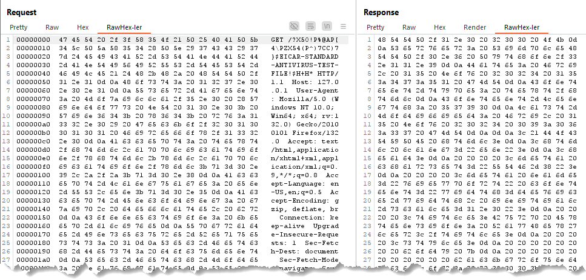
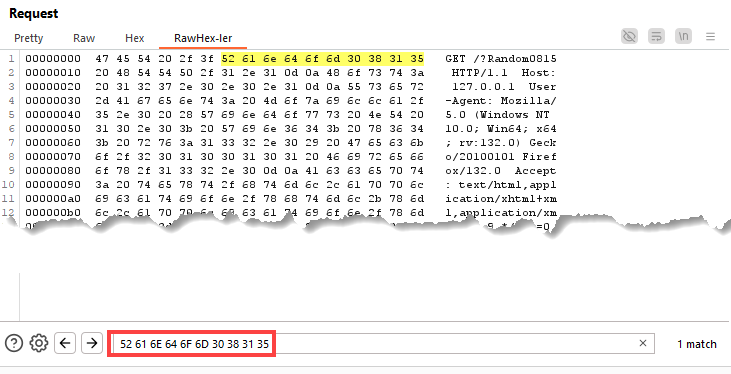
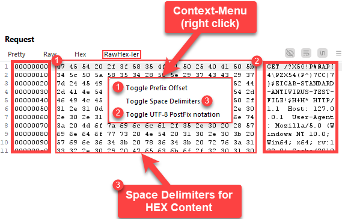
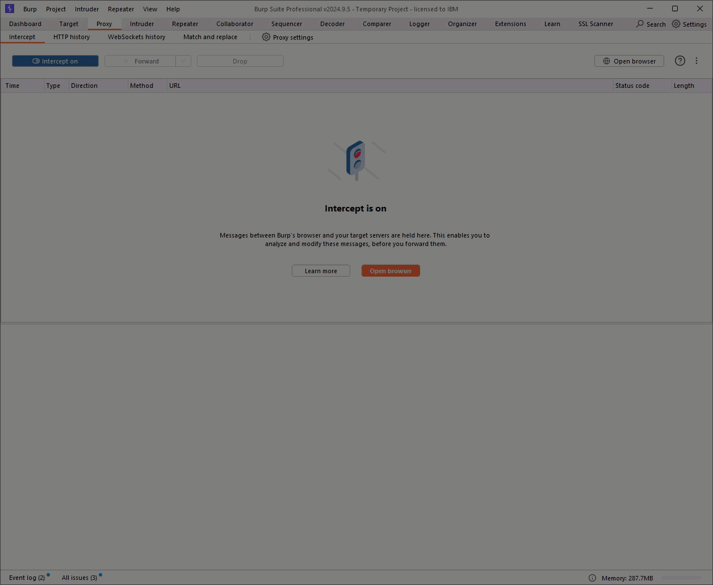

# Burp Extension: RawHex'ler

## Description
RawHex'ler is a Burp Suite extension designed to enhance the handling of HEX data within HTTP requests and responses.
It introduces a new, integrated tab that allows for seamless manipulation of raw HEX requests/responses in a hexdump format, offering greater flexibility compared to the standard Hex editor.
RawHex'ler does not aim to replace the existing Hex editor tab but instead enhances Burp Suite by adding a missing feature that facilitates HEX byte(s) insertion via copy/paste.

## Features

- **HEX Handling**: Paste or modify raw HEX string(s) in a continuous line
- **Integrated Tab**: Adds a new tab in each HTTP Request/Response view (alongside Pretty, Raw, Hex, etc.) called RawHex'ler.
- **Context Menu Access**: Right-click within the RawHex'ler tab to access a variety of display modes and settings, allowing you to tailor the HEX data presentation to your preferences.

### Bonus Featurs

- Copy and paste EICAR or other antivirus-signatured content as HEX directly into a request/response without needing the file on disk ;)
- Search and highlight HEX strings with standard Burp Suite search field at the bottom of the RawHex'ler tab

## Toggleable Settings

NOTE: Changes to settings in an existing RawHex'ler tab will apply globally to all newly created RawHex'ler tabs.

- **Prefix Offset**: Choose to add or remove a HEX offset representation at the start of each line. This helps in tracking byte positions within the data.
- **Space Delimiters**: Option to include or exclude space delimiters in the hex content for improved readability.
- **UTF-8 Postfix Notation**: Enable or disable the display of UTF-8 encoded characters alongside the HEX data, aiding in the interpretation of human-readable text within the binary data.
  **Attention**: Carriage-return (`\r`) and newline (`\n`) characters are displayed as spaces in the UTF-8 postfix. This postfix data is read-only, meaning any modifications to it will not alter the actual content.
- **Reformat Editor**: Resets the editor to the Burp hex formatting. 
   **Attention**: It does not save the current editor content in the request, you have to click save to actually save them to the request.
- **hex-File to Clipboard**: Let's you choose a file which will then be converted to hex, put into the clipboard and into the search bar.
- **Paste hex from Clipboard**: Pastes hex formatted Clipboard content at current cursor position.
- **Paste from hex File**: Opens a Menu to select a file which will then be converted to hex and pasted at the current cursor position. The editor will automatically be reformatted.

## Screenshots:

## Demo

The following demo shows RawHex'ler in action by replacing a query string via copy&paste of HEX representation with the EICAR string.

## Author

- Sebastian Vetter: https://github.com/svetterIO
